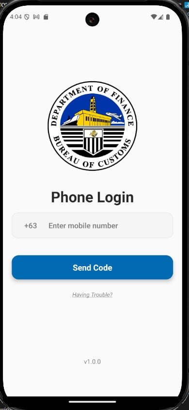
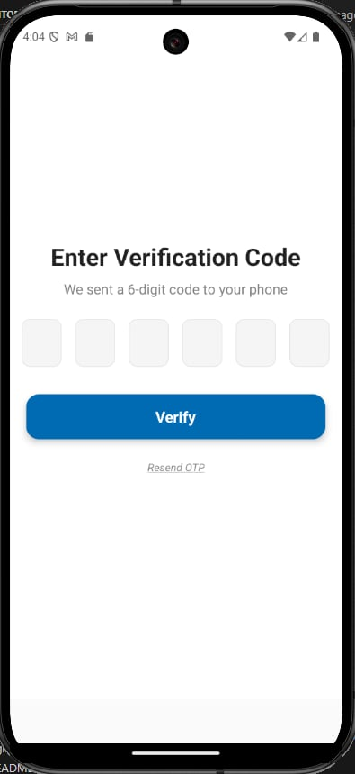
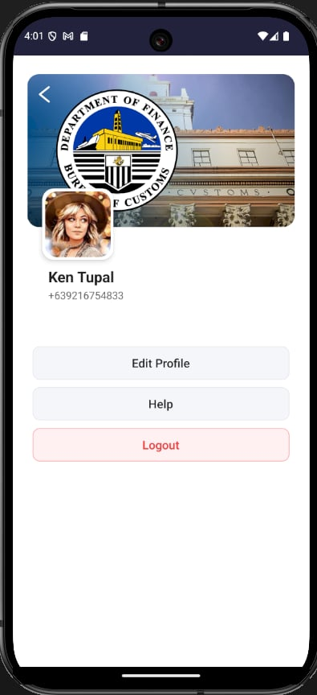
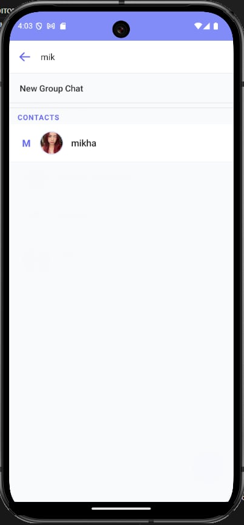

# 🛃 Bureau of Customs – Internal Chat App

A secure, real-time messaging platform built for Bureau of Customs personnel to communicate internally. Designed to enhance coordination and ensure safe exchange of messages and files within the agency.

---

## 🖼️ Demo

Below are some screenshots of the app in action:

|                Messages List                 |              Chat View               |                   New Group                    |                    Edit Group                    |
| :------------------------------------------: | :----------------------------------: | :--------------------------------------------: | :----------------------------------------------: |
|  |  |  |  |

|                     Edit Profile                     |                 Login                  |          OTP Verification          |                User Profile                |
| :--------------------------------------------------: | :------------------------------------: | :--------------------------------: | :----------------------------------------: |
|  |  |  |  |

|             Search Contacts              |               Group Members                |                   User Card                    |
| :--------------------------------------: | :----------------------------------------: | :--------------------------------------------: |
|  |  |  |

> For a full walkthrough, you can [download the demo video](assets/demo.mkv) or [watch it online](#) (replace with your video link if hosted externally).

---

## 🚀 Features

- 🔐 **OTP-Only Login**  
  Ensures secure access through phone-based one-time passwords.

- 💬 **Real-Time Messaging**  
  Built with Firebase for instant communication between authorized personnel.

- 🗂️ **File Upload Support**  
  Send and receive images and documents with cloud storage integration.

- 🔔 **Cloud Notifications**  
  Get notified immediately for new messages and updates.

- 📱 **Responsive & Cross-Platform**  
  Optimized for mobile and tablet use with React Native.

---

## ⚙️ Tech Stack

- **Frontend:** React Native (Expo)
- **Backend:** Firebase Authentication, Firestore, Firebase Cloud Storage
- **Notifications:** Firebase Cloud Messaging (FCM)
- **Authentication:** OTP-based phone login (via Twilio)
- **File Handling:** Cloud file uploads via Firebase Storage

---

## 🔒 Why Internal Chat?

The app was designed specifically for the Bureau of Customs to:

- Eliminate the use of insecure 3rd-party messaging apps
- Provide a private communication channel between staff
- Enable safe and efficient file sharing
- Simplify access with mobile number login only

---

## 📂 Project Status

✅ Fully functional internal version in production  
🛠️ Currently enhancing file preview and admin tools
