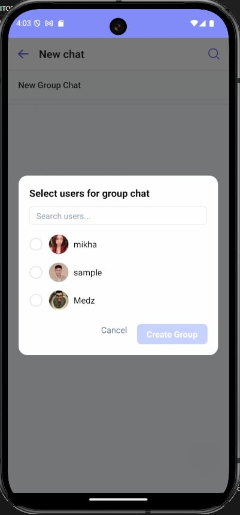

# 🛃 Bureau of Customs – Internal Chat App

A secure, real-time messaging platform built for Bureau of Customs personnel to communicate internally. Designed to enhance coordination and ensure safe exchange of messages and files within the agency.

---

## 🖼️ Demo

Below are screenshots of the app in action:

|               Chat List                |               Chat Room                |               Create Group                |                Edit Group                |
| :------------------------------------: | :------------------------------------: | :---------------------------------------: | :--------------------------------------: |
|  |  |  |  |

|                 Edit Profile                 |              Login              |      OTP Verification       |            User Profile             |
| :------------------------------------------: | :-----------------------------: | :-------------------------: | :---------------------------------: |
|  |  |  |  |

|              Search               |               Group Members                |                 View Profile                 |
| :-------------------------------: | :----------------------------------------: | :------------------------------------------: |
|  |  |  |

> For a full walkthrough, you can [download the demo video](assets/demo/demo.mkv) or [watch it online](#) (replace with your video link if hosted externally).

---

## 📝 Details

**Tech Stack:**

- React Native (Expo)
- Firebase (Authentication, Firestore, Cloud Storage, Cloud Messaging)
- Twilio (for OTP SMS)
- Lottie (loading animations)
- Expo AV (video playback)
- react-native-responsive-screen (responsive UI)
- Expo Router (navigation)

**Main Features:**

- OTP-based phone login (via Twilio)
- Real-time 1-on-1 and group chat (Firestore)
- File sharing: images, videos, documents (with previews and download)
- Group management: add/remove members, edit group name/avatar
- User profile management (edit profile, upload avatar)
- Message read/unread indicators
- Responsive design for mobile/tablet
- System messages for group events (e.g., member added/removed, group name changed)
- Profile popups and modals for user/group info

**Key Components:**

- ChatList & ChatItem: List and preview of chats
- MessageList & MessageItem: Display messages, files, and system events
- FileMessage: Handles file/image/video previews and downloads
- MembersModals: Group member management (add, remove, leave)
- ProfilePopup: Shows user details in a modal
- HomeHeader & ChatRoomHeader: Navigation and profile access

**Setup Requirements:**

- Configure Firebase project and Twilio credentials
- Set up environment variables for API keys and endpoints
- Place demo images and video in `assets/screenshots/` and reference in README

---

## 🔒 Why Internal Chat?

The app was designed specifically for the Bureau of Customs to:

- Eliminate the use of insecure 3rd-party messaging apps
- Provide a private communication channel between staff
- Enable safe and efficient file sharing
- Simplify access with mobile number login only

---
